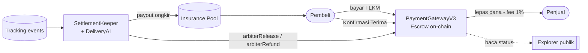

<div align="center">

# 🛰️ E-Trace

### Marketplace on-chain yang transparan sepenuhnya

*Belanja pakai kripto (TLKM) semudah e-wallet — setiap pembayaran dijaga **smart-contract escrow**, dan setiap transaksi bisa diverifikasi siapa saja di blockchain.*


</div>

---

## 📌 Ringkasan

Di marketplace konvensional, uang pembeli dipegang perusahaan — pembeli harus percaya platform, penjual menunggu pencairan, alur dana gelap. **E-Trace memindahkan kepercayaan dari perusahaan ke kode**: dana pembeli ditahan *smart contract* (escrow) dan baru lepas ke penjual setelah pembeli mengonfirmasi barang diterima. Setiap pembayaran punya jejak on-chain yang tidak bisa diubah siapa pun.

Di atas fondasi escrow itu, E-Trace menumbuhkan **ekosistem keuangan on-chain**: kredit *Paylater* dua sisi, penyelesaian escrow **otomatis oleh AI**, garansi pengiriman berbasis asuransi parametrik, dan explorer transparansi publik.

## ✨ Fitur Utama

### 🛒 Marketplace & Escrow
- **Pembayaran escrow via smart contract (TLKM)** — dana ditahan kontrak, lepas ke penjual saat pembeli konfirmasi; refund bila penjual tak mengirim.
- **Escrow multi-penjual** — satu keranjang banyak penjual; escrow dipisah per item, konfirmasi satu item tak melepas dana penjual lain.
- **Verifikasi on-chain** — backend membaca kontrak sebagai sumber kebenaran (total, nominal, penjual), tidak percaya data dari browser.

### 💳 Paylater — Pinjam & Danai
- **Pool likuiditas dua sisi**: peminjam **Pinjam** (checkout sekarang, bayar nanti) dan pemberi dana **Danai** (setor TLKM ke pool).
- **Deposito berjangka** — fleksibel / 30 / 90 hari, **bagi hasil (nisbah)** naik seiring jangka.
- Bunga, pool, dan jangka **tercatat di smart contract** (`TlkmPaylater.sol`).

### 🤖 AI Auto-Settlement + Garansi Tepat Waktu
- **Keeper** membaca riwayat tracking → **DeliveryAI (LLM)** memutuskan `release / refund / hold`; keputusan disimpan untuk audit.
- **Aturan deterministik**: tidak dikirim N hari → **auto-refund**; barang diterima & tak dikonfirmasi M hari → **auto-selesai** (dilewati untuk tujuan jauh).
- **On-Time Guarantee** — asuransi ongkir parametrik: ETA berbasis **jarak**, payout dari pool bila telat karena penjual/kurir. Idempoten + *circuit breaker* harian.

### 🔎 Explorer Transparansi
- Dashboard publik: volume, transaksi, escrow ditahan, toko teratas, entitas terverifikasi.
- **Visualisasi** — grafik aktivitas 14 hari (volume + transaksi) & donut distribusi status escrow.

### 👛 Wallet, Keamanan & Lainnya
- **Embedded wallet** (email/HP + **PIN**) — pengguna awam tak perlu paham seed phrase; tanda tangan sekali, berikutnya cukup PIN.
- **Cloudflare Turnstile** anti-bot di login/daftar (aman-nonaktif bila belum dikonfigurasi).
- **Chatbot AI** bantuan aplikasi + pencarian produk (OpenAI, dibatasi ke ruang lingkup app).
- **Laporan keuangan penjual** (rekap otomatis + HPP, ekspor Excel/PDF).
- **Donasi transparan / dompet komunitas** — tercatat on-chain, **0% fee**.
- Registrasi **OTP email** (RabbitMQ) + opsi **2FA**, peran pembeli/penjual/pengawas, **dwibahasa** (ID/EN).

## 🧱 Arsitektur Singkat



Kebenaran status (delivered/late) dihitung **di server** dari `tracking_events` + AI — **tidak** percaya browser. Semua aksi arbiter ditandatangani kunci arbiter platform di `.env` (rahasia).

## 🔗 Smart Contracts (Solidity, BSC Testnet)

| Kontrak | Fungsi |
|---|---|
| `contracts/PaymentGatewayV3.sol` | Escrow multi-penjual: bayar, konfirmasi, refund, aksi arbiter, fee 1% saat rilis |
| `contracts/TlkmPaylater.sol` | Pool lending dua sisi: supply/withdraw, borrow/repay, deposito berjangka + nisbah |
| **TLKM** (BEP-20) | Token pembayaran platform (18 desimal) |

> Panduan deploy ke BSC Testnet ada di **`contracts/PANDUAN-DEPLOY.md`**. Alamat kontrak dibaca dari `.env` via `config/chain.php` (satu sumber kebenaran).

## 🛠️ Tech Stack

| Lapisan | Teknologi |
|---|---|
| Backend | Laravel 12, PHP 8.2 |
| Frontend | Blade, Tailwind CSS, Vite, ethers.js, Chart.js |
| Database | MySQL |
| Antrean | RabbitMQ (email OTP & notifikasi) |
| Blockchain | Solidity 0.8.20, BEP-20 (TLKM), **BNB Smart Chain Testnet** (chainId 97) |
| Integrasi Web3 | web3.php, ethereum-tx, keccak, elliptic-php |
| AI | OpenAI `gpt-4o-mini` (chatbot + DeliveryAI settlement) |
| Keamanan | Cloudflare Turnstile, google2fa (2FA), PIN gate |
| Lain-lain | bacon-qr-code, dompdf (PDF), maatwebsite/excel |

## 🚀 Mulai Cepat

```bash
# 1. Dependency
composer install
npm install

# 2. Environment
cp .env.example .env
php artisan key:generate

# 3. Migrasi + seed (atur .env dulu — lihat Konfigurasi)
php artisan migrate --seed

# 4. Build aset
npm run build      # atau: npm run dev

# 5. Jalankan
php artisan serve
```

Jalankan di terminal terpisah:

```bash
php artisan queue:work      # email OTP & notifikasi (RabbitMQ)
php artisan schedule:work   # keeper AI-settlement + klaim asuransi (cek harian)
```

## ⚙️ Konfigurasi (.env)

```env
# Database
DB_CONNECTION=mysql
DB_DATABASE=crypto
DB_USERNAME=root
DB_PASSWORD=

# Antrean (RabbitMQ)
QUEUE_CONNECTION=rabbitmq
RABBITMQ_HOST=127.0.0.1

# AI (chatbot + settlement) — RAHASIA
OPENAI_API_KEY=sk-...

# Blockchain (BNB Smart Chain Testnet)
CHAIN_ID=97
CHAIN_RPC_URL=https://data-seed-prebsc-1-s1.bnbchain.org:8545/
CHAIN_EXPLORER_URL=https://testnet.bscscan.com
TLKM_ADDRESS=0x...              # setelah deploy
PAYMENT_GATEWAY_ADDRESS=0x...   # setelah deploy

# Keeper / asuransi (opsional; fitur aman-nonaktif bila kosong)
KEEPER_ARBITER_PRIVATE_KEY=...  # RAHASIA — kunci arbiter platform
INSURANCE_POOL_ADDRESS=0x...

# Anti-bot (opsional)
TURNSTILE_SITE_KEY=
TURNSTILE_SECRET_KEY=
```

> 🔒 **`.env` berisi rahasia dan TIDAK di-commit.** Jangan pernah menaruh private key / API key di repo.

## 🧪 Alur Uji Coba (End-to-End)

1. Daftar / login (email + OTP, atau wallet).
2. Jadikan akun **penjual**: `php artisan tinker` → `App\Models\User::where('email','...')->update(['role'=>'seller']);`
3. Penjual buat produk (harga TLKM). Pembeli (punya TLKM) → **Beli** → approve → bayar ke escrow.
4. Cek tx hash di **BscScan Testnet** sebagai bukti transparansi (atau via **Explorer** internal).
5. Barang diterima → **Konfirmasi Terima** (dana lepas ke penjual). Tak dikirim 3 hari → **auto-refund** oleh keeper.

## 💰 Model Bisnis

Pendapatan platform = **fee 1%** dari nilai transaksi, ditanggung penjual (dipotong dari payout, tidak dibebankan pembeli). Donasi & dompet komunitas **gratis (0% fee)**.

## ⚠️ Catatan Penting

- Berjalan di **testnet** (chainId 97) dengan token uji coba — **bukan uang sungguhan**.
- Smart contract **belum diaudit** — prototipe untuk kompetisi/edukasi.
- Data pribadi (alamat, telepon) disimpan di database, **tidak** on-chain — sejalan dengan UU PDP.

## 📁 Struktur Ringkas

```
app/          Controller, Model, Service (ChainVerifier, DeliveryAI, ShippingService), Command (SettlementKeeper)
contracts/    Smart contract Solidity (PaymentGatewayV3, TlkmPaylater) + panduan deploy
database/     Migrasi & seeder
resources/    Tampilan Blade + aset frontend
routes/       Definisi rute (web, console)
```

<div align="center">
<sub>Dibangun di atas BNB Smart Chain Testnet · escrow yang bisa dibuktikan siapa saja.</sub>
</div>
