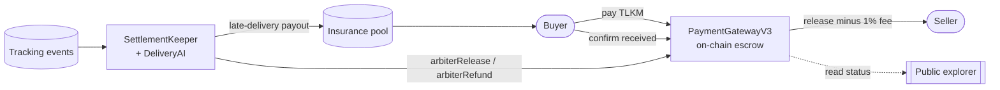

<div align="center">


# E-Trace

### Every payment held in escrow, every transaction on-chain. Don't trust. Trace.

*Shop with crypto (TLKM) as easily as with an e-wallet. Every payment is held by a **smart-contract escrow**, and anyone can verify every transaction on the blockchain.*


**[🌐 Live app: e-trace.shop](https://e-trace.shop)** · **[📚 Docs](https://khairy.gitbook.io/e-trace/)** · **[🎬 Demo video](https://youtu.be/QE7p25uFDSw)**

</div>

---

## 📌 Overview

In a conventional marketplace, the company holds the buyer's money. Buyers have to trust the platform, sellers wait for payouts, and nobody can see where the money goes. **E-Trace moves that trust from the company to code.** The buyer's money is held by a smart contract (escrow) and is released to the seller only after the buyer confirms the goods arrived. Every payment leaves an on-chain trail that nobody can change.

On top of that escrow, E-Trace builds an **on-chain financial ecosystem**: two-sided *Paylater* credit, **AI-driven** escrow settlement, parametric delivery insurance, transparent donations, community wallets and a public transparency explorer.

## 🔗 Links

| | |
| --- | --- |
| **Live app** | [https://e-trace.shop](https://e-trace.shop) |
| **Documentation** (user flows, contracts, business model, roadmap) | [https://khairy.gitbook.io/e-trace](https://khairy.gitbook.io/e-trace/) |
| **Demo video** | [E-Trace \| The Transparent Blockchain Marketplace](https://youtu.be/QE7p25uFDSw) |
| **Network** | BNB Smart Chain Testnet (chain ID 97) |

## 📜 Smart contract addresses (BSC Testnet)

| Contract | Address | What it does |
| --- | --- | --- |
| **PaymentGatewayV3** | [`0x76e783878E4d88e435c4296F87c56446be72FDc9`](https://testnet.bscscan.com/address/0x76e783878E4d88e435c4296F87c56446be72FDc9) | Multi-seller escrow: pay, confirm, refund, dispute, arbiter actions, 1% fee on release |
| **TLKM Token** (BEP-20) | [`0x5D628943164d5D27eB102424045901e26720B4C1`](https://testnet.bscscan.com/address/0x5D628943164d5D27eB102424045901e26720B4C1) | Payment token used across the app (18 decimals) |
| **DonationPool** | [`0xdCCE11EADbE5426f946a61D7705C56761dF2f394`](https://testnet.bscscan.com/address/0xdCCE11EADbE5426f946a61D7705C56761dF2f394) | Donation campaigns and recorded disbursements |
| **TlkmPaylater** | [`0x69D8f32F7e918061f32F26Ad7302906Cd857FCc1`](https://testnet.bscscan.com/address/0x69D8f32F7e918061f32F26Ad7302906Cd857FCc1) | Collateralised credit + lending pool with fixed terms and profit sharing |
| **CommunityMultisigWallet** | one per group, e.g. [`0xa408e7991b7585ea3b94e38a5312d39169c8849f`](https://testnet.bscscan.com/address/0xa408e7991b7585ea3b94e38a5312d39169c8849f) | Shared community wallet; every action needs signer approval |

Sources are in [`contracts/`](contracts/). The app reads contract addresses from `.env` via `config/chain.php`.

## ✨ Features

### 🛒 Marketplace and escrow
- **Smart-contract escrow payments (TLKM).** The contract holds the funds and releases them to the seller when the buyer confirms; refunds if the seller never ships.
- **Multi-seller escrow.** One cart, many sellers; escrow is split per item, so confirming one item doesn't release another seller's funds.
- **On-chain verification.** The backend reads the contract as the source of truth (totals, amounts, sellers) and never trusts the browser.

### 💳 Paylater: borrow and fund
- **Two-sided liquidity pool.** Borrowers **borrow** (check out now, pay later) and funders **fund** (deposit TLKM into the pool).
- **Fixed terms.** Flexible / 30 / 90 days, with a **profit share** that grows with the term.
- Interest, pool and terms are **recorded in the smart contract** (`TlkmPaylater.sol`).

### 🤖 AI auto-settlement + On-Time Guarantee
- A **keeper** reads tracking history, and **DeliveryAI (LLM)** decides `release / refund / hold`; every decision is stored for audit.
- **Deterministic rules.** Not shipped in N days → **auto-refund**; delivered and not confirmed in M days → **auto-complete**.
- **On-Time Guarantee.** Parametric shipping insurance: **distance-based** ETA, automatic payout from the pool when the seller or courier is late. Idempotent, with a daily circuit breaker.

### 🌋 Disaster Radar and transparent donations
- Disaster news feeds on-chain **donation campaigns**; every donation and disbursement is public, with **0% fee**.
- **Community wallets** (multisig) for cooperatives, schools and groups.

### 🔎 Transparency explorer
- Public dashboard: volume, transactions, escrow held, top stores, verified entities.
- 14-day activity chart and escrow status distribution.

### 👛 Wallet, security and more
- **Embedded wallet** (email + **PIN**): no seed phrase needed. MetaMask login is also supported (Sign-In with Ethereum).
- **Cloudflare Turnstile**, email OTP, optional **2FA**, rate limits.
- **AI chatbot (EVA)** for app help and product search.
- **Seller financial reports** (automatic summaries + COGS, Excel/PDF export).
- **Sponsored home banners** (jumbotron) for sellers and brands.
- Buyer / seller / supervisor roles, **bilingual UI (English / Bahasa Indonesia)**.

## 🧱 Architecture


```mermaid
flowchart LR
    Buyer([Buyer]) -- "pay TLKM" --> ESC[PaymentGatewayV3<br/>on-chain escrow]
    Buyer -- "confirm received" --> ESC
    ESC -- "release minus 1% fee" --> Seller([Seller])
    KEEP[SettlementKeeper<br/>+ DeliveryAI] -- "arbiterRelease / arbiterRefund" --> ESC
    Track[(Tracking events)] --> KEEP
    KEEP -- "late-delivery payout" --> Pool[(Insurance pool)]
    Pool --> Buyer
    ESC -. "read status" .-> Explorer[[Public explorer]]
```

Delivery status (delivered / late) is computed **on the server** from `tracking_events` + AI, never from the browser. Arbiter actions are signed with the platform arbiter key, which lives only in environment variables.

## 💰 Business model

E-Trace earns when it adds value: when a trade closes safely, when credit is repaid, when a delivery is insured, and when brands want shoppers' attention. Donations stay free. Every fee is on-chain, so the platform can prove what it earns.

| Revenue stream | How it works |
| --- | --- |
| **Escrow fee** | 1% of each completed sale, taken only when funds are released and paid by the seller from the payout. Refunds are free. Hard-coded in the contract and capped at 10% |
| **Paylater interest share** | Borrowers pay a flat 3%; the platform keeps 40% / 30% / 15% of it depending on the funder's term (flexible / 30 days / 90 days) |
| **Sponsored banners** | Paid weekly slots in the home-page carousel for sellers, brands and partners, paid in TLKM with an on-chain receipt. Later: pay per impression or click |
| **On-Time Guarantee** | Margin between delivery-insurance premiums and payouts, with per-claim and daily caps |
| **Premium seller tools** *(later)* | Advanced reports, analytics and AI tools as a monthly subscription for high-volume stores |
| **Donations and community wallets** | Always free (0% fee) |

**Market (Indonesia)**

| | Market | Size |
| --- | --- | --- |
| **TAM** | E-commerce users | 73 million (Ministry of Trade, 2025) |
| **SAM** | Online SMEs, donors and donations | 4.4M SMEs, 11.7M donors, 1M donations |
| **SOM** | First-market target | 500 SMEs, 100 communities, 10,000 users and donors |

**3-year revenue projection (IDR)**, with transaction volume (GMV) growing 25% a year:

| | Year 1 | Year 2 | Year 3 |
| --- | --- | --- | --- |
| Transaction volume (GMV) | 10.0 B | 12.5 B | 15.6 B |
| Escrow fee (1%) | 100 M | 125 M | 156 M |
| Sponsored banners | 60 M | 90 M | 130 M |
| Paylater interest share | 32 M | 45 M | 63 M |
| On-Time Guarantee margin | 10 M | 15 M | 20 M |
| **Total revenue** | **202 M** | **275 M** | **369 M** |

B = billion, M = million. These are projections, not results. Assumptions and Paylater economics: [Business model](https://khairy.gitbook.io/e-trace/project/business-model).

## 🗺️ Roadmap

| Phase | When | Focus |
| --- | --- | --- |
| **0 · Testnet MVP** ✅ | Q3 2026 | Multi-seller escrow with disputes and arbitration, embedded wallet (PIN, OTP, 2FA), Paylater pool, AI auto-settlement and On-Time Guarantee, Disaster Radar donations, Transparency Explorer, seller reports, EN/ID |
| **1 · Stabilize and onboard** | Q4 2026 – Q1 2027 | Ship the fixes from the [internal audit](https://khairy.gitbook.io/e-trace/project/audit-report) in a new contract version, then an **external audit**. Self-serve seller onboarding and ad booking, real courier APIs, stablecoin checkout |
| **2 · Mainnet and expansion** | Q2 – Q3 2027 | **Mainnet on BNB Smart Chain**, price oracle and liquidation for Paylater, multisig or community arbitration, smarter AI assistant, mobile app, onboarding SMEs, cooperatives, schools and mosques |
| **3 · Transparency API** | Q4 2027 → | Open escrow, on-chain receipts and the explorer to donation institutions, cooperatives and government agencies through a public API. Institutional partnerships become a revenue stream |

Full roadmap: [Roadmap](https://khairy.gitbook.io/e-trace/project/roadmap).

## 💸 Fundraising

We are raising a **USD 150,000 pre-seed round** (about IDR 2.4 billion) for **18 months of runway**, to take E-Trace from testnet to mainnet and reach our first-market target.

| Use of funds | Share | USD |
| --- | --- | --- |
| Security audits (external smart-contract and app audit) | 25% | 37,500 |
| Engineering (courier integrations, mobile, oracle, transparency API) | 40% | 60,000 |
| Seller and community acquisition | 20% | 30,000 |
| Legal and compliance (payments, personal data protection law) | 15% | 22,500 |
| **Total** | **100%** | **150,000** |

**What this round unlocks**

- External audit completed and every finding fixed
- Mainnet launch on BNB Smart Chain
- First-market target: 500 SMEs, 100 communities, 10,000 users and donors
- About IDR 10 billion in yearly transaction volume

**Who we're talking to:** Web3-focused VCs and accelerators, BNB Chain ecosystem grants, and Indonesian fintech angels.

**Why E-Trace:** the product is already live on testnet with real flows end to end. Every fee and donation is verifiable on-chain, so traction and revenue can be audited by anyone, investors included.

## 🛡️ Security

- Contracts use `ReentrancyGuard` and `SafeERC20`; the escrow fee is immutable and capped at 10%.
- The contracts went through an internal review with [Pashov's solidity-auditor skills](https://github.com/pashov/skills) (3 passes, multiple agents). 28 findings (5 high, 10 medium, 9 low, 4 informational) are acknowledged and will be fixed in the next contract version before mainnet, followed by an external audit. Full list: [Audit report](https://khairy.gitbook.io/e-trace/project/audit-report).
- The web app went through a security review; the critical and high findings (upload handling, insurance premium verification, IP spoofing, wallet registration nonce) are fixed.
- See [Security and audit status](https://khairy.gitbook.io/e-trace/project/security). Found a vulnerability? Please open a private [security advisory](https://github.com/Gkhairy/E-Trace/security).

## 🛠️ Tech stack

| Layer | Technology |
|---|---|
| Backend | Laravel 12, PHP 8.2 |
| Frontend | Blade, Tailwind CSS, Vite, ethers.js, Chart.js |
| Database | MySQL |
| Queue | RabbitMQ (email OTP and notifications) |
| Blockchain | Solidity 0.8.20, BEP-20 (TLKM), **BNB Smart Chain Testnet** (chain ID 97) |
| Web3 | web3.php, ethereum-tx, keccak, elliptic-php |
| AI | OpenAI `gpt-4o-mini` (chatbot + DeliveryAI settlement) |
| Security | Cloudflare Turnstile, google2fa (2FA), PIN gate |
| Other | bacon-qr-code, dompdf (PDF), maatwebsite/excel |
| Deploy | Docker (nginx + php-fpm) on Railway |

## 🚀 Quick start

```bash
# 1. Dependencies
composer install
npm install

# 2. Environment
cp .env.example .env
php artisan key:generate

# 3. Migrate + seed (configure .env first, see below)
php artisan migrate --seed

# 4. Build assets
npm run build      # or: npm run dev

# 5. Run
php artisan serve
```

In separate terminals:

```bash
php artisan queue:work      # email OTP and notifications (RabbitMQ)
php artisan schedule:work   # AI-settlement keeper + insurance claims (daily)
```

## ⚙️ Configuration (.env)

```env
# Database
DB_CONNECTION=mysql
DB_DATABASE=crypto
DB_USERNAME=root
DB_PASSWORD=

# Queue (RabbitMQ)
QUEUE_CONNECTION=rabbitmq
RABBITMQ_HOST=127.0.0.1

# AI (chatbot + settlement), secret
OPENAI_API_KEY=sk-...

# Blockchain (BNB Smart Chain Testnet)
CHAIN_ID=97
CHAIN_RPC_URL=https://data-seed-prebsc-1-s1.bnbchain.org:8545/
CHAIN_EXPLORER_URL=https://testnet.bscscan.com
TLKM_ADDRESS=0x5D628943164d5D27eB102424045901e26720B4C1
PAYMENT_GATEWAY_ADDRESS=0x76e783878E4d88e435c4296F87c56446be72FDc9

# Keeper / insurance (optional; features stay off when empty)
KEEPER_ARBITER_PRIVATE_KEY=...  # secret, platform arbiter key
INSURANCE_POOL_ADDRESS=0x...

# Anti-bot (optional)
TURNSTILE_SITE_KEY=
TURNSTILE_SECRET_KEY=
```

> 🔒 **`.env` holds secrets and is never committed.** Never put private keys or API keys in the repository.

## 🧪 End-to-end test flow

1. Sign up / log in (email + OTP + PIN, or MetaMask).
2. Make the account a **seller**: `php artisan tinker` → `App\Models\User::where('email','...')->update(['role'=>'seller']);`
3. The seller creates a product (priced in TLKM). The buyer (holding TLKM) → **Buy** → approve → pay into escrow.
4. Look up the tx hash on **BscScan Testnet** as proof (or in the built-in **Explorer**).
5. Goods arrive → **Confirm received** (funds released to the seller). Not shipped in 3 days → **auto-refund** by the keeper.

Step-by-step guides for buyers, sellers, Paylater, donations and community wallets are in the [docs](https://khairy.gitbook.io/e-trace/).

## ⚠️ Notes

- Runs on **testnet** (chain ID 97) with test tokens: **not real money**.
- A prototype built for a hackathon; do not send real funds to these contracts.
- Personal data (addresses, phone numbers) stays in the database, **not** on-chain, in line with Indonesia's PDP law.

## 📁 Project structure

```
app/          Controllers, models, services (ChainVerifier, DeliveryAI, ShippingService), commands (SettlementKeeper)
contracts/    Solidity smart contracts
database/     Migrations and seeders
docs/         Documentation source (published on GitBook)
docker/       nginx + php-fpm config for deployment
resources/    Blade views + frontend assets (English and Bahasa Indonesia)
routes/       Route definitions (web, console)
```

<div align="center">
<sub>Built on BNB Smart Chain Testnet · escrow anyone can verify.</sub>
</div>
