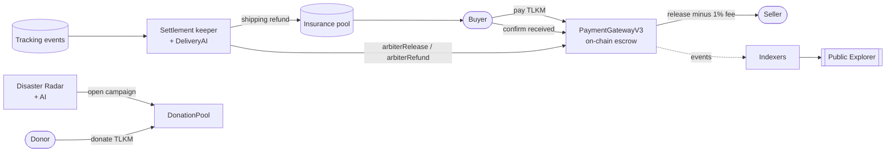

# Architecture and tech stack

### How the pieces fit

* **Laravel app (web).** Serves the site and the API, signs PIN transactions for embedded wallets, and verifies every payment against the contract before trusting it.
* **Worker.** Runs the scheduler and queue:
  * escrow indexer and TLKM transfer indexer, every minute,
  * settlement keeper, daily,
  * Disaster Radar scan, daily at 07:00,
  * email OTP and notifications through the queue.
* **Smart contracts** on BNB Smart Chain Testnet hold the money and enforce the rules. The server holds the arbiter key and the pool key; both are secrets kept in environment variables, never in the repository.

Both the web and worker services are built from **one Docker image** (nginx + php-fpm) and deployed on Railway, so they always run the same code.

### Tech stack

| Layer              | Technology                                                                   |
| ------------------ | ---------------------------------------------------------------------------- |
| Backend            | Laravel 12, PHP 8.2                                                          |
| Frontend           | Blade, Tailwind CSS, Vite, ethers.js, Chart.js                               |
| Database           | MySQL                                                                        |
| Queue              | Database or RabbitMQ                                                         |
| Blockchain         | Solidity 0.8.20, OpenZeppelin, BEP-20, BNB Smart Chain Testnet (chain ID 97) |
| Web3 on the server | web3.php, ethereum-tx, keccak, elliptic-php                                  |
| AI                 | OpenAI `gpt-4o-mini`: chatbot, DeliveryAI, Disaster Radar                    |
| Security           | Cloudflare Turnstile, google2fa, PIN gate                                    |
| Other              | RajaOngkir (shipping rates), dompdf, maatwebsite/excel, bacon-qr-code        |
| Hosting            | Docker on Railway                                                            |
