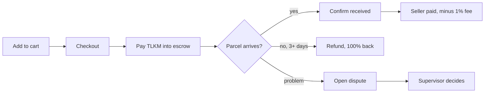

# Buyer

### 1. Checkout

Add products to your cart. One cart can hold items from many sellers. At checkout you pick a delivery address and a shipping option, then pay in TLKM.

* **Embedded wallet:** enter your PIN. The server signs and sends the transaction for you.
* **Browser wallet:** approve TLKM once, then sign the `payCart` transaction.

The contract pulls the cart total in one transfer and records **each item as its own escrow**, keyed by order and position. Confirming one item never touches the money for another item.

### 2. Wait for delivery

The seller marks the item as shipped and you can follow tracking on the order page (tracking events are simulated on testnet). Your money stays in the [PaymentGatewayV3](../smart-contracts/payment-gateway-v3.md) contract the whole time.

If you bought the [On-Time Guarantee](../how-it-works/on-time-guarantee.md), you get your shipping cost back automatically when the parcel is late.

### 3. Close the order

| What happened                            | What you do          | Where the money goes                                                                                                  |
| ---------------------------------------- | -------------------- | --------------------------------------------------------------------------------------------------------------------- |
| The parcel arrived and it's fine         | **Confirm received** | Seller gets the item price minus 1%; the 1% goes to the platform                                                      |
| The seller hasn't shipped after 3 days   | **Refund**           | 100% back to you, no fee                                                                                              |
| Something is wrong (damaged, wrong item) | **Open dispute**     | Frozen until a supervisor releases or refunds it                                                                      |
| You forget to confirm                    | Nothing              | The keeper completes the order a few days after delivery (see [AI auto-settlement](../how-it-works/ai-settlement.md)) |

Every one of these actions is an on-chain event. Click the transaction hash on the order page to see it on BscScan.


Once you open a dispute you can no longer refund yourself. Only the supervisor (the contract's arbiter) can close a disputed item.

